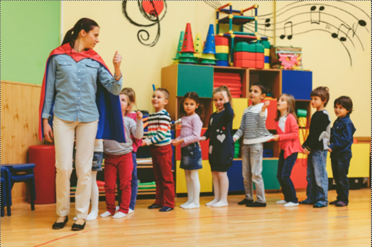
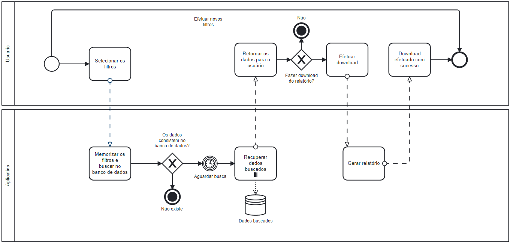
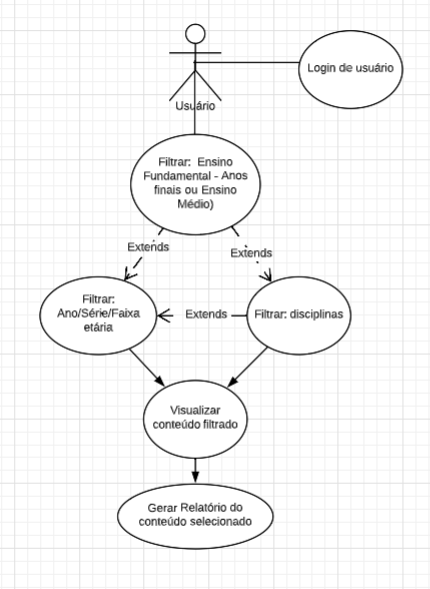
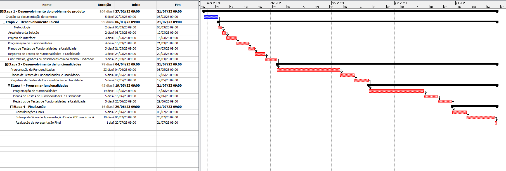
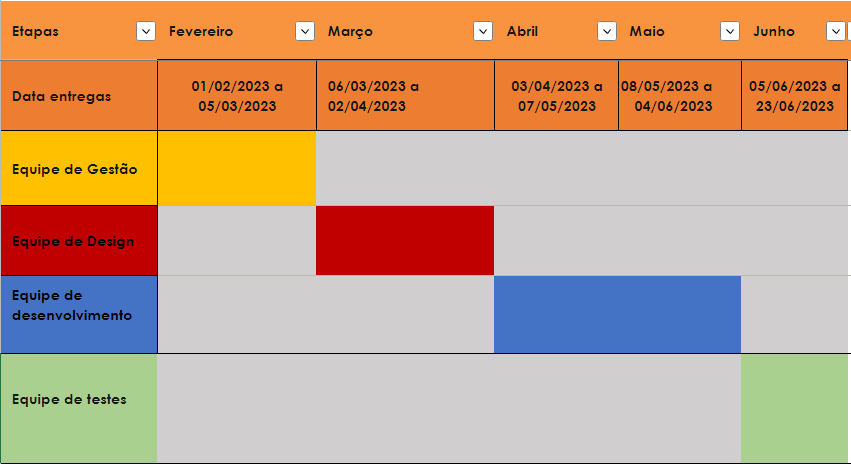

# Especificações do Projeto

Pré-requisitos: <a href="1-Documentação de Contexto.md"> Documentação de Contexto</a>

A definição exata do problema e os pontos mais relevantes a serem tratados neste projeto foi consolidada com a participação dos usuários em um trabalho de imersão feita pelos membros da equipe a partir da observação dos usuários em seu local natural e por meio de entrevistas. Os detalhes levantados nesse processo foram consolidados na forma de personas e histórias de usuários. 

## Personas

As personas levantadas durante o processo de entendimento do problema são apresentadas nos quadros a seguir.

| |
|------|
|**Nome:** `Marilene Santos `| 
|**Idade:** `30 anos `|  
|**Formação:** `Pedagogia`|  
|**Ocupação:** `Professor Infantil` |  
|**Aplicativos:** `Instagram / Facebook / YouTube`  |  
|**Motivações** `Proporcionar um ambiente criativo para seus alunos `|
|**Frustrações:** `Gostaria de se especializar mais para o trabalho` |  
|**Hobbies:** `Fazer aulas de teatro ` |  

 

| |
|------|
|**Nome:** `Gabriele Silva  `| 
|**Idade:** `32 anos `|  
|**Formação:** `Letras - Língua Portuguesa - Licenciatura`|  
|**Ocupação:** `Professor de Português` |  
|**Aplicativos:** `Instagram / Facebook / YouTube/ TikTok` |  
|**Motivações** `Ensinar a língua portuguesa com situações do cotidiano`|
|**Frustrações:** `Falta de tempo para viajar com a família` |  
|**Hobbies:** `Dedicar-se à leitura` |  

 

| |
|------|
|**Nome:** `Newton Albuquerque `| 
|**Idade:** `63 anos`|  
|**Formação:** `Matemática - Licenciatura / Física`|  
|**Ocupação:** `Professor de Matemática e Física` |  
|**Aplicativos:** `Facebook`|  
|**Motivações** `Desenvolver a lógica matemática em seus alunos `|
|**Frustrações:** `Gostaria de lecionar física em laboratórios` |  
|**Hobbies:** `Pescar` |  

 

| |
|------|
|**Nome:** `Natalia Marques `| 
|**Idade:** `28 anos `|  
|**Formação:** `Pedagogia `|  
|**Ocupação:** `Supervisor de Escola ` |  
|**Aplicativos:** `Instagram / TikTok / Facebook / YouTube ` |  
|**Motivações** `Sustentar os professores e monitorar as atividades de informática`|
|**Frustrações:** `Falta de tempo para estudar novas línguas ` |  
|**Hobbies:** `Aprender uma nova língua ` |  

 

| |
|------|
|**Nome:** `Lúcia Guimarães `| 
|**Idade:** `52 anos `|  
|**Formação:** `Pedagogia / Geografia Licenciatura `|  
|**Ocupação:** `Diretor de Escola ` |  
|**Aplicativos:** `Facebook / YouTube ` |  
|**Motivações** `Garantir o ensino conforme normas do MEC `|
|**Frustrações:** `Falta de apoio do governo para uma educação de melhor qualidade` |  
|**Hobbies:** `Participar de uma comunidade/sociedade de bairro ` |  

 

| |
|------|
|**Nome:** `Daniela Andrade `| 
|**Idade:** `35 anos `|  
|**Formação:** `Pedagogia`|  
|**Ocupação:** `Professor Particular ` |  
|**Aplicativos:** `Instagram / TikTok / Facebook / YouTube ` |  
|**Motivações** `Apoiar seus alunos de forma específica e divertida `|
|**Frustrações:** `Falta de tempo para praticar pilates ` |  
|**Hobbies:** `Ir à academia` |  

 

| |
|------|
|**Nome:** `Lucas Ferrari `| 
|**Idade:** `26 anos `|  
|**Formação:** `Educação Física - Licenciatura `|  
|**Ocupação:** `Estudante com foco em Concurso Público  ` |  
|**Aplicativos:** `Instagram / TikTok / Facebook / Twitch / YouTube` |  
|**Motivações** `Ingressar em uma Instituição Pública e desenvolver pesquisas`|
|**Frustrações:** `Gostaria de dedicar-se integralmente aos estudos` |  
|**Hobbies:** `Andar de bicicleta pela cidade ` |  

 

## Histórias de Usuários

A partir da compreensão do dia a dia das personas identificadas para o projeto, foram registradas as seguintes histórias de usuários.

|EU COMO... `PERSONA`| QUERO/DESEJO ... `O QUE` |PARA ...  `POR QUE`               |
|--------------------|------------------------------------|----------------------------------------|
|Marilene Santos   | Simplicidade das informações  | Trabalhar de forma mais objetiva com os seus alunos             |
|Gabriele Silva       | Visão de todos os itens relacionados a sua matéria              | Planejar os estudos de forma contínua e a longo prazo |
|Newton Albuquerque        | Simplicidade das informações               |Deseja garantir a montagem de suas aulas de acordo com a finalidade proposta da matéria |
|Natalia Marques        | Visão de várias matérias por séria de forma gráfica                | Necessita acompanhar várias montagens de planos de estudos de forma simultanea |
|Lúcia Guimarães        | Indicadores das informações de forma macro               | Garantir os objetivos propostos de todos os alunos |
|Daniela Andrade         | Seleção de objetivos                | Visão que permita a seleção apenas de objetivos que precisam ser trabalhados com seu aluno |
|Lucas Ferrari        | Seleção de todos os itens relacionados a sua prova                | Visualizar de acordo com sua prova a ser realizada, apenas os conteúdos que precisam ser estudados |

## Modelagem do Processo de Negócio 

### Análise da Situação Atual

Fácil seleção de habilidades a serem desenvolvidas pelos alunos, lista de objetos de conhecimento e planos de aula feitos a partir de um banco de dados. Esse é o cenário ideal para professores realizarem planejamentos, quer sejam os de uma simples aula, quer de todo um curso.  

Entretanto, não é isso que os docentes têm disponível no mercado de tecnologia de hoje. De forma manual, é comum que os professores tenham que abrir um documento de 900 páginas, a Base Nacional Curricular Comum - BNCC, e procurar as habilidades e objetos do conhecimento a serem ensinados em seu respectivo ano e área que lecionam.  

Dessa forma, este trabalho propõe armazenar a BNCC em um banco de dados e disponibilizar planos de aula em uma aplicação mobile voltada para esses profissionais da educação. 

### Descrição Geral da Proposta

Este projeto apresenta uma solução para a grande dificuldade de se montar um plano de aulas baseado na Base Nacional Curricular Comum. Oportunamente, a aplicação também se torna uma importante fonte de consulta para os professores e outros educadores estudarem para concursos, visto que tal conteúdo é amplamente exigido na maioria dos processos seletivos e concursos voltados para a área da educação. E assim possibilitar a montagem de um plano de aulas e plano de curso baseado na BNCC e também a consulta da BNCC por meio do acesso ao banco de dados montado no celular do usuário. 
### Processo 1 – MODELAGEM AS IS

O AS-IS é a situação atual dos processos, ou seja, como os processos funcionam hoje. Sem realizar nenhuma análise crítica e sem discutir se o processo está bom ou ruim 

### Processo 2 – MODELAGEM TO BE

O TO-BE é o processo futuro, ou seja, ele é o processo melhorado, aquele processo que queremos que a empresa venha a seguir. Ele é o processo onde as melhorias estão sendo implementadas.

## Indicadores de Desempenho

Apresentados abaixo os principais indicadores de desempenho e algumas metas para o processo.

Usar o seguinte modelo: 

Obs.: todas as informações para gerar os indicadores devem estar no diagrama de classe a ser apresentado a posteriori. 

## Requisitos

As tabelas que se seguem apresentam os requisitos funcionais e não funcionais que detalham o escopo do projeto.

### Requisitos Funcionais

|ID    | Descrição do Requisito  | Prioridade |
|------|-----------------------------------------|----|
|RF-001| Permitir que o usuário faça login na aplicação | MÈDIA |
|RF-002| Permitir que o usuário que o usuário possa filtrar as opções: Ensino médio, Ensino fundamental - Anos finais | ALTA |
|RF-003| Permitir que o usuário possa filtrar por Ano/Série/Faixa etária | ALTA |
|RF-004| Permitir que o usuário possa filtrar por Matérias   | ALTA |
|RF-005| Permitir que o usuário possa filtrar por habilidades | ALTA |
|RF-006| Permitir que o usuário visualize uma tabela com os filtros aplicados | MÈDIA |
|RF-007| Permitir que o usuário faça download de um relatório de acordo com o conteúdo que foi selecionado  | ALTA |

### Requisitos não Funcionais

|ID    | Descrição do Requisito  | Prioridade |
|------|-----------------------------------------|----|
|RNF-001| O banco de dados deve ser hospedado na nuvem para acesso da aplicação | ALTA |
|RNF-002| A aplicação deve ser publicada em um ambiente acessível publicamente na Internet | ALTA |
|RNF-003| A aplicação deve ter um tempo de resposta baixo para as requisições | MÉDIA |
|RNF-004| A aplicação deve possuir uma interface limpa e intuitiva para o usuário | BAIXA |
|RNF-005| A aplicação deve garantir segurança para autenticação do usuário   | ALTA |
|RNF-006| A aplicação deve criptografar a senha do usuário   | ALTA |

## Restrições

O projeto está restrito pelos itens apresentados na tabela a seguir.

|ID    | Descrição do Requisito  | Prioridade |
|------|-----------------------------------------|----|
|RE-001| O projeto deve ser entregue no prazo estipulado pelo cronograma letivo |ALTA| 
|RE-002| A aplicação deve se restringir às tecnologias propostas |ALTA|
## Diagrama de Casos de Uso

Na imagem abaixo é apresentado o diagrama de casos de uso do projeto.

# Matriz de Rastreabilidade

A matriz de rastreabilidade é uma ferramenta usada para facilitar a visualização dos relacionamentos entre requisitos e outros artefatos ou objetos, permitindo a rastreabilidade entre os requisitos e os objetivos de negócio. 

A matriz deve contemplar todos os elementos relevantes que fazem parte do sistema, conforme a figura meramente ilustrativa apresentada a seguir.

# Gerenciamento de Projeto

De acordo com o PMBoK v6 as dez áreas que constituem os pilares para gerenciar projetos, e que caracterizam a multidisciplinaridade envolvida, são: Integração, Escopo, Cronograma (Tempo), Custos, Qualidade, Recursos, Comunicações, Riscos, Aquisições e Partes Interessadas. Para desenvolver projetos um profissional deve se preocupar em gerenciar todas essas dez áreas. Elas se complementam e se relacionam, de tal forma que não se deve apenas examinar uma área de forma estanque. É preciso considerar, por exemplo, que as áreas de Escopo, Cronograma e Custos estão muito relacionadas. Assim, se eu amplio o escopo de um projeto eu posso afetar seu cronograma e seus custos.

### Gerenciamento de Tempo
Com diagramas bem organizados que permitem gerenciar o tempo nos projetos, o gerente de projetos agenda e coordena tarefas dentro de um projeto para estimar o tempo necessário de conclusão.

O gráfico de Gantt ou diagrama de Gantt também é uma ferramenta visual utilizada para controlar e gerenciar o cronograma de atividades de um projeto. Com ele, é possível listar tudo que precisa ser feito para colocar o projeto em prática, dividir em atividades e estimar o tempo necessário para executá-las.

### Gerenciamento de Equipe
O gerenciamento adequado de tarefas contribuirá para que o projeto alcance altos níveis de produtividade. Por isso, é fundamental que ocorra a gestão de tarefas e de pessoas, de modo que os times envolvidos no projeto possam ser facilmente gerenciados. 

### Gestão de Orçamento

O processo de determinar o orçamento do projeto é uma tarefa que depende, além dos produtos (saídas) dos processos anteriores do gerenciamento de custos, também de produtos oferecidos por outros processos de gerenciamento, como o escopo e o tempo.

