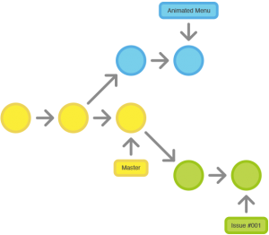
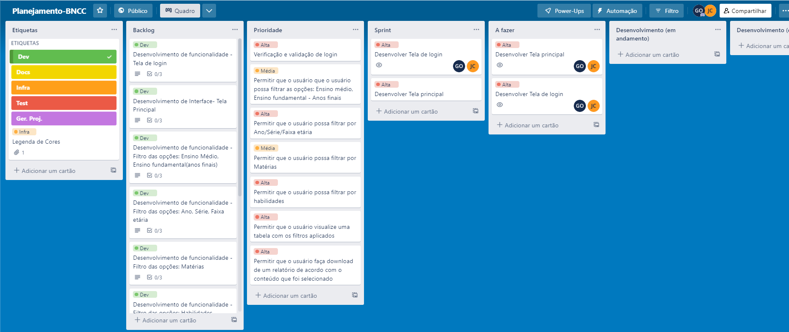
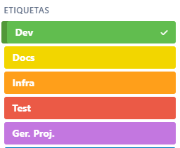

# Metodologia

Pré-requisitos: <a href="2-Especificação do Projeto.md"> Documentação de Especificação</a>

Serão abordados nesse tópico as ferramentas utilizadas para a construção da plataforma e manutenções futuras dos códigos e artefatos.

## Relação de Ambientes de Trabalho

Os artefatos do projeto são desenvolvidos a partir de diversas plataformas e a relação dos ambientes com seu respectivo propósito é apresentada na tabela abaixo.

---

| Ambiente                          | Plataforma | Link de acesso                                                                                                          |
| --------------------------------- | ---------- | ----------------------------------------------------------------------------------------------------------------------- |
| Repositório de código fonte       | Github     |https://github.com/GuruDevOp7884/pmv-ads-2023-1-e3-proj-mov-t6-grupo7-planejamento-bncc                |
| Documentos do projeto             | Github     | https://github.com/GuruDevOp7884/pmv-ads-2023-1-e3-proj-mov-t6-grupo7-planejamento-bncc/tree/main/docs |
| Projeto de Interface e Wireframes | MarvelApp  | `Em análise`                                                                                           |
| Gerenciamento do Projeto          | Trello     | https://trello.com/b/8lJOQrrJ/planejamento-bncc                                                                               |

---

## Controle de Versão

A ferramenta de controle de versão adotada no projeto foi o
[Git](https://git-scm.com/), sendo que o [Github](https://github.com)
foi utilizado para hospedagem do repositório.

Para gestão do código fonte da aplicação produzida pela equipe, o grupo utiliza um processo baseado no WorkFlow, mostrado a seguir, retirado de Vietro (2020). Dessa forma, todas as alterações no código são realizadas em branches, nas quais os desenvolvedores devem criar uma branch para cada funcionalidade nova no projeto. Assim, as alterações no código da branch principal se faz por meio de um aceite após um pull request via GitHub.

---

---
## Gerenciamento de Projeto

### Divisão de Papéis

Nossa equipe utiliza metodologias ágeis, tendo escolhido o Scrum como base para definição do processo de desenvolvimento.

A equipe está organizada da seguinte maneira:

* Scrum Master:
  - `Gustavo Alves Oliveira`
* Equipe de Desenvolvimento:
  -  `José Carlos da Costa Júnior`
* Equipe de Design:
  - `Jefferson Filho`
### Processo

Para organização e distribuição das tarefas do projeto, a equipe utiliza o Trello, o qual é estruturado com as seguintes listas: 
-	<b>Backlog</b>: Recebe as tarefas a serem trabalhadas e representa o Product Backlog. Todas as atividades identificadas no decorrer do projeto também vão ser incorporadas a esta lista.

-  <b>Prioridade</b>: Esta lista detalha a prioridade dos requisitos do software

-	<b>A Fazer</b>: Esta lista representa o Sprint Backlog. Este é o Sprint atual que estamos trabalhando.

-	<b>Em andamento</b>: Quando uma tarefa tiver sido iniciada, ela é movida para cá.

-	<b>Teste</b>: Checagem de qualidade. Quando as tarefas são concluídas. No final da semana, eu revejo essa lista para garantir que tudo saiu perfeito.

-	<b>Concluído</b>: Nesta lista são colocadas as tarefas que passaram pelos testes e controle de qualidade e estão prontos para ser entregues ao usuário.

O quadro kanban do grupo no Trello está disponível através da URL: https://trello.com/b/8lJOQrrJ/planejamento-bncc e é apresentado na imagem abaixo.

---
As tarefas são etiquetadas em função da natureza da atividade e seguem o seguinte esquema de cores/categorias:
-	Desenvolvimento 
-	Documentação                                 
-	Infraestrutura
-	Testes
-	Gerência de Projetos.

### Ferramentas

As ferramentas empregadas no projeto são:

- Editor de código.
  - `Visual studio Code`
  -  `Visual studio` 
- Ferramentas de comunicação
  - `Trello`
- Ferramentas de desenho de tela (_wireframing_)
  - `MarvelApp`

O editor de código foi escolhido pela facilidade de utilização e familiaridade dos desenvolvedores com o mesmo.

- Github
  - `Auxiliará no controle de versão da applicação`
- Trello
  - `Auxiliará na gestão dos requisitos/backlog`
- Microsoft Teams
  - `Auxiliará na comunicação do time `
 
---